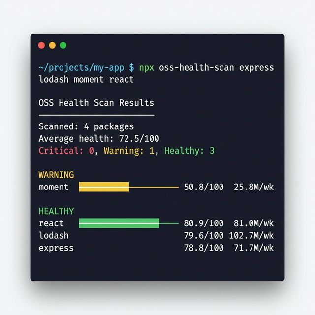
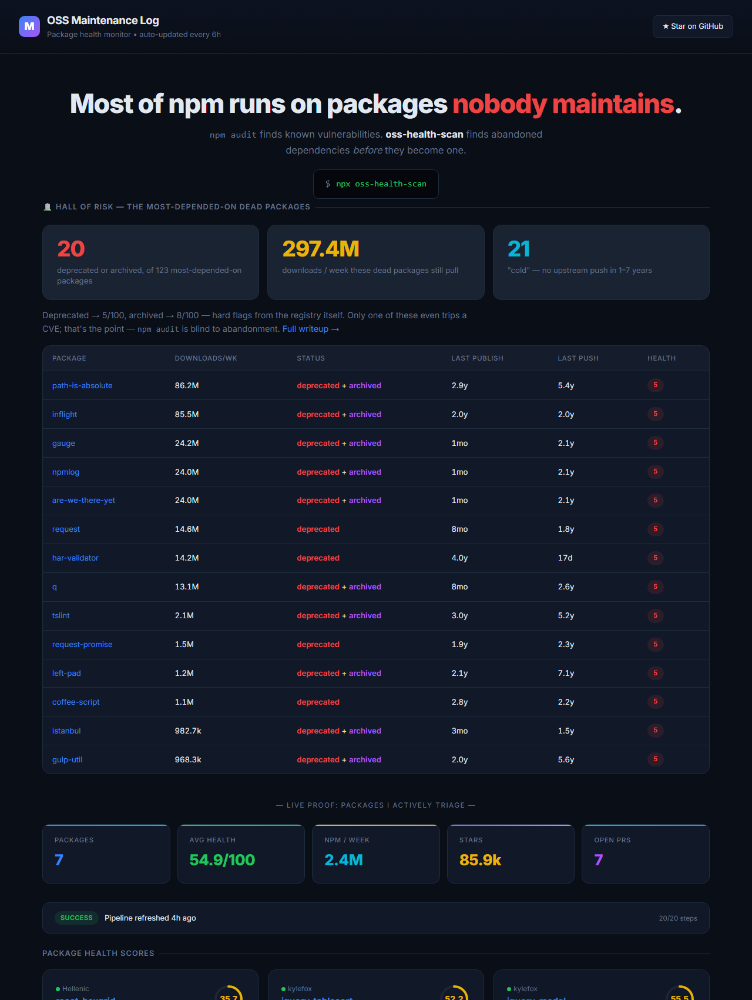
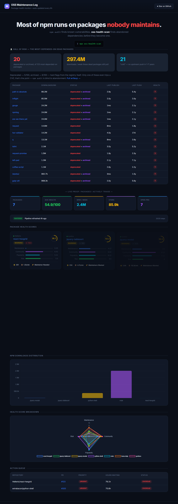

# OSS Maintenance Log

> <!-- TAGLINE:START -->Contributing to 7 open-source packages — **765k npm downloads/week** across tracked ecosystem.<!-- TAGLINE:END -->

[](https://github.com/dusan-maintains/oss-maintenance-log/stargazers)
[](https://www.npmjs.com/package/oss-health-scan)

<!-- RUN_STATUS:START -->
[](https://github.com/dusan-maintains/oss-maintenance-log/actions/workflows/evidence-daily.yml)
[](https://github.com/dusan-maintains/oss-maintenance-log/actions/workflows/validate.yml)
<!-- RUN_STATUS:END -->
[](./LICENSE)
[](#currently-tracked-projects)
[](#-live-data)
[](#contributions)
[](https://github.com/dusan-maintains/oss-maintenance-log/actions)

---

## 🔬 Scan Your Dependencies — In One Command

```bash
npx oss-health-scan express lodash moment react
```



```
  OSS Health Scan Results
  ──────────────────────────────────────────────────
  Scanned: 4 packages
  Average health: 72.5/100
  ● Critical: 0  ● Warning: 1  ● Healthy: 3

   🟡 WARNING
  moment                              ██████████░░░░░░░░░░ 50.8/100  last push 582d ago  25.8M/wk

   🟢 HEALTHY
  react                               ████████████████░░░░ 80.9/100  81.0M/wk
  lodash                              ████████████████░░░░ 79.6/100  102.7M/wk
  express                             ████████████████░░░░ 78.8/100  71.7M/wk
```

**Zero dependencies. v1.5.0.** Scans any npm package, scores 0–100, detects outdated versions (libyear), checks known CVEs via OSV.dev, auto-retries on failures, exits with code 1 on critical findings. GitHub GraphQL batching (1 API call for 50 packages). SARIF output for GitHub Code Scanning. Programmatic API for custom integrations. CI-ready.

`npm audit` finds CVEs. **This finds abandoned packages, outdated deps, AND vulnerabilities — in one command.**

<details>
<summary><strong>CLI flags</strong></summary>

```bash
npx oss-health-scan            # Scan ./package.json
npx oss-health-scan pkg1 pkg2   # Scan specific packages
npx oss-health-scan --dev       # Include devDependencies
npx oss-health-scan --outdated  # Show installed vs latest + libyear metric
npx oss-health-scan --vulns     # Check OSV.dev for known CVEs
npx oss-health-scan --unused    # Detect unused dependencies
npx oss-health-scan --json      # JSON output for CI
npx oss-health-scan --sarif     # SARIF 2.1.0 for GitHub Code Scanning
npx oss-health-scan --markdown  # Markdown table for PR comments
npx oss-health-scan --threshold 40  # Only unhealthy
npx oss-health-scan --sort name # Sort by: score, name, downloads, risk
```
</details>

<details>
<summary><strong>Programmatic API</strong></summary>

```javascript
const { scanPackages, scanPackageJson } = require('oss-health-scan');

// Scan specific packages
const { results } = await scanPackages(['react', 'lodash', 'moment']);
for (const r of results) {
  console.log(`${r.name}: ${r.health_score}/100 [${r.risk_level}]`);
}

// Scan a project's package.json
const { results, pkgName } = await scanPackageJson('.', { dev: true });
```
</details>

<details>
<summary><strong>Config file</strong></summary>

Add to `package.json` or create `.oss-health-scanrc.json`:
```json
{
  "oss-health-scan": {
    "threshold": 40,
    "exclude": ["moment"],
    "dev": true
  }
}
```
</details>

<details>
<summary><strong>GitHub Code Scanning (SARIF)</strong></summary>

```yaml
- name: Scan dependency health
  run: npx oss-health-scan --sarif > health.sarif

- uses: github/codeql-action/upload-sarif@v3
  with:
    sarif_file: health.sarif
```
</details>

---

## 📊 Interactive Dashboard

[**➜ Open Live Dashboard**](https://dusan-maintains.github.io/oss-maintenance-log)




Dark-mode dashboard with Chart.js — health score gauges, npm download distribution, radar breakdown, action queue. Auto-updates every 6 hours with fresh data.

---

## Problem

Thousands of packages are effectively abandoned while still receiving hundreds of thousands of weekly downloads. Issue trackers fill up, security patches go unmerged, and downstream teams inherit silent risk. `npm audit` catches CVEs — but **not abandoned packages**.

## What This Does

Config-driven PowerShell + GitHub Actions that automatically:

- **Polls GitHub API** — stars, forks, issues, last push date per repo
- **Pulls npm downloads** — weekly rolling window
- **Tracks PRs** — state, mergeability, diff stats for your contributions
- **Monitors review SLA** — flags when maintainer feedback goes stale
- **Computes health scores (0–100)** — weighted engine with SVG badges
- **Detects trends** — 180-day history, 7-day and 30-day deltas
- **Fires alerts** — auto-creates GitHub Issues when packages drop below critical threshold
- **Generates action queue** — prioritized by urgency
- **Commits snapshots** — machine-readable JSON + human-readable Markdown every 6 hours
- Renders **interactive dark-mode dashboard** on GitHub Pages

## Currently Tracked Projects

<!-- TRACKED_PROJECTS:START -->
| Project | Stars | npm/week | Status | Health | My PRs |
|---------|-------|----------|--------|--------|--------|
| [grafana/grafana](https://github.com/grafana/grafana) | 72.8k | — | 🟢 Open |  | [#119212](https://github.com/grafana/grafana/pull/119212) |
| [lingdojo/kana-dojo](https://github.com/lingdojo/kana-dojo) | 1.9k | — | ✅ **Merged** |  | [#6309](https://github.com/lingdojo/kana-dojo/pull/6309) |
| [kylefox/jquery-modal](https://github.com/kylefox/jquery-modal) | 2.6k | 11.3k | 🟡 Maintainers Wanted |  | [#315](https://github.com/kylefox/jquery-modal/pull/315), [#316](https://github.com/kylefox/jquery-modal/pull/316), [#317](https://github.com/kylefox/jquery-modal/pull/317) |
| [kylefox/jquery-tablesort](https://github.com/kylefox/jquery-tablesort) | 258 | 1.9k | 🟡 Maintainers Wanted |  | [#49](https://github.com/kylefox/jquery-tablesort/pull/49) |
| [extrabacon/python-shell](https://github.com/extrabacon/python-shell) | 2.2k | 106.4k | 🔴 Maintainer Gap |  | [#320](https://github.com/extrabacon/python-shell/pull/320) |
| [jkbrzt/rrule](https://github.com/jkbrzt/rrule) | 3.7k | 644.6k | 🔴 Open Backlog |  | [#664](https://github.com/jkbrzt/rrule/pull/664) |
| [Hellenic/react-hexgrid](https://github.com/Hellenic/react-hexgrid) | 351 | 713 | 🟡 Maintainer Needed |  | [#123](https://github.com/Hellenic/react-hexgrid/pull/123) |
<!-- TRACKED_PROJECTS:END -->

*Across tracked projects:* **<!-- STATS:START -->83.8k stars · 765k downloads/week across tracked projects · refreshed 03/21/2026<!-- STATS:END -->**

## Health Scoring

Each package gets a **weighted health score (0–100)**:

| Dimension | Weight | Metrics |
|-----------|--------|---------|
| **Maintenance** | 40% | Last push recency (exponential decay), last npm publish, open issues ratio |
| **Community** | 25% | GitHub stars (log-scaled), forks |
| **Popularity** | 20% | npm downloads/week (log-scaled) |
| **Risk** | 15% | Inactivity penalty, issue backlog, stale publish, license risk |

**Instant flags:** DEPRECATED → 5/100, ARCHIVED → 8/100.

## Contributions

### Merged

<!-- CONTRIBUTIONS_MERGED:START -->
- **kana-dojo [#6309](https://github.com/lingdojo/kana-dojo/pull/6309)** — content: add new japanese idiom. Merged 02/27/2026.
<!-- CONTRIBUTIONS_MERGED:END -->

### Open

<!-- CONTRIBUTIONS_OPEN:START -->
- **grafana [#119212](https://github.com/grafana/grafana/pull/119212)** — Emails: Remove external Google Fonts and logo URL from email templates
- **jquery-modal [#315](https://github.com/kylefox/jquery-modal/pull/315)** — fix: harden close button rendering and refresh docs/examples
- **jquery-modal [#316](https://github.com/kylefox/jquery-modal/pull/316)** — fix: keep ajax callbacks scoped to their originating modal
- **jquery-modal [#317](https://github.com/kylefox/jquery-modal/pull/317)** — fix: make plugin initialization idempotent for multiple imports
- **jquery-tablesort [#49](https://github.com/kylefox/jquery-tablesort/pull/49)** — Fix stale tablesort.$th reference after header clicks
- **python-shell [#320](https://github.com/extrabacon/python-shell/pull/320)** — Fix runString temp path to use tmpdir() and add regression test
- **rrule [#664](https://github.com/jkbrzt/rrule/pull/664)** — fix: handle WeekdayStr arrays when serializing BYDAY
- **react-hexgrid [#123](https://github.com/Hellenic/react-hexgrid/pull/123)** — test: add coverage for GridGenerator.ring and .spiral
<!-- CONTRIBUTIONS_OPEN:END -->

## Use It Yourself

### Quick Scan (no install)

```bash
npx oss-health-scan express lodash moment
```

### Full Monitoring Setup

1. Fork this repository
2. Edit `config/tracked-repositories.json` — your packages, PRs, SLA settings
3. Push — GitHub Actions runs every 6 hours
4. `evidence/` fills with JSON + Markdown snapshots
5. Health scores + SVG badges auto-generate

```json
{
  "version": 1,
  "contributor": "your-github-username",
  "default_sla_hours": 24,
  "repositories": [
    {
      "owner": "org",
      "repo": "package-name",
      "package": "npm-package-name",
      "tracked_pr_numbers": [42]
    }
  ]
}
```

### CI Integration

```yaml
# .github/workflows/health-check.yml
name: Dependency Health Check
on:
  schedule:
    - cron: "0 9 * * 1"
  pull_request:

jobs:
  scan:
    runs-on: ubuntu-latest
    steps:
      - uses: actions/checkout@v4
      - uses: actions/setup-node@v4
      - run: npx oss-health-scan --threshold 30

  # Optional: upload to GitHub Code Scanning
  sarif:
    runs-on: ubuntu-latest
    permissions:
      security-events: write
    steps:
      - uses: actions/checkout@v4
      - uses: actions/setup-node@v4
      - run: npx oss-health-scan --sarif > health.sarif
      - uses: github/codeql-action/upload-sarif@v3
        with:
          sarif_file: health.sarif
```

### GitHub Action (reusable)

```yaml
- uses: dusan-maintains/oss-maintenance-log@main
  id: health
  with:
    github-token: ${{ secrets.GITHUB_TOKEN }}

- name: Fail on critical
  if: steps.health.outputs.critical-count > 0
  run: |
    echo "Found ${{ steps.health.outputs.critical-count }} critical packages"
    echo "Average health: ${{ steps.health.outputs.avg-health }}"
    exit 1
```

<!-- LIVE_DATA:START -->
## 📊 Live Data

- [📊 Interactive Dashboard](https://dusan-maintains.github.io/oss-maintenance-log) — health scores, charts, action queue
- [Health Scores](./evidence/health-scores.md) — weighted 0-100 per package
- [Ecosystem Status](./evidence/ecosystem-status.md) — aggregated snapshot
- [Action Queue](./evidence/action-queue.md) — prioritized tasks
- Per-repo SLA: [grafana](./evidence/review-sla-grafana.md) · [kana-dojo](./evidence/review-sla-kana-dojo.md) · [jquery-modal](./evidence/review-sla.md) · [tablesort](./evidence/review-sla-tablesort.md) · [python-shell](./evidence/review-sla-python-shell.md) · [rrule](./evidence/review-sla-rrule.md) · [react-hexgrid](./evidence/review-sla-react-hexgrid.md)
<!-- LIVE_DATA:END -->

## Project Structure

```
config/tracked-repositories.json     ← All configuration
scripts/
  common.ps1                        ← Shared functions (DRY)
  update-all-evidence.ps1            ← Single orchestrator (full pipeline)
  compute-health-scores.ps1          ← Health scoring (0-100)
  compute-trends.ps1                 ← 180-day trend engine
  check-alerts.ps1                   ← Auto GitHub Issues
  update-readme-stats.ps1            ← Auto-regenerates all README sections
cli/
  bin/scan.js                        ← CLI entry point
  lib/api.js                         ← Programmatic API (scanPackages, scanPackageJson)
  lib/scoring.js                     ← JS health algorithm
  lib/sarif.js                       ← SARIF 2.1.0 output for GitHub Code Scanning
  lib/outdated.js                    ← Libyear metric + drift classification
  lib/osv.js                         ← CVE check via OSV.dev API
  lib/unused.js                      ← Unused dependency detection
  lib/github-graphql.js              ← GitHub GraphQL batch API (1 query for N repos)
  lib/fetcher.js                     ← HTTP client with retry + 429 handling + ETag cache
  lib/reporter.js                    ← Colored terminal output
evidence/
  *.json, *.md                       ← Machine + human snapshots
  badges/*.svg                       ← Health badges
tests/
  common.Tests.ps1                   ← Pester v5 tests (21 passing)
  health-score.Tests.ps1
cli/test/
  *.test.js                          ← 71 JS tests
.github/workflows/
  evidence-daily.yml                 ← Cron: full pipeline every 6 hours
  validate.yml                       ← CI: config + Pester + CLI tests
  publish-cli.yml                    ← Publish to npm on release
```

## License

MIT

---

*Auto-updated every 6 hours by [GitHub Actions](https://github.com/dusan-maintains/oss-maintenance-log/actions).*
